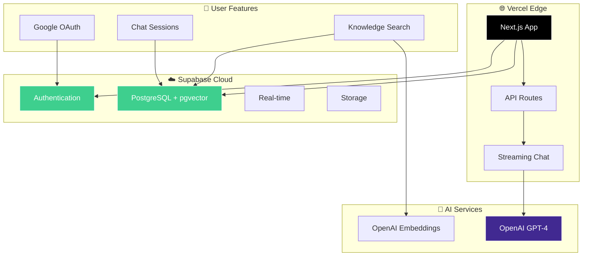

# ✈️ AirAssist - IVAO US Division AI Assistant

<div align="center">


**🤖 AI-powered assistant for IVAO US Division air traffic control training and procedures**

*Built with Next.js, Supabase, OpenAI, and modern streaming chat interface*

[**🚀 Deploy on Vercel**](https://vercel.com/deploy) • [**📖 Documentation**](#-documentation) • [**💡 Features**](#-features) • [**🛠️ Development**](#️-development)

</div>

---

## 🎯 Quick Start

### 🚀 Deploy to Vercel (Recommended)
```bash
# 1. Clone the repository
git clone https://github.com/your-username/airassist.git
cd airassist

# 2. Deploy to Vercel
vercel deploy

# 3. Set up Supabase and add environment variables
```

### 💻 Local Development
```bash
# 1. Clone and setup
git clone https://github.com/your-username/airassist.git
cd airassist
npm install

# 2. Setup environment
cp .env.example .env.local
# Add your Supabase and OpenAI keys

# 3. Start development server
npm run dev
```

---

## ✨ Features

### 🤖 AI-Powered Intelligence
- **OpenAI GPT-4** - Latest OpenAI model for accurate ATC guidance
- **Real-time Streaming** - Watch AI responses generate live with thinking process
- **Semantic Search** - Vector-based search using Supabase pgvector for precise answers
- **Smart Context Management** - Intelligent conversation history and knowledge retrieval

### 🏗️ Modern Cloud Architecture
- **Supabase Backend** - Serverless PostgreSQL with built-in authentication
- **Vercel Deployment** - Edge deployment with automatic scaling
- **Vector Search** - pgvector extension for semantic knowledge retrieval
- **Real-time Streaming** - Server-sent events for responsive chat experience

### 🎨 Enhanced User Experience
- **Streaming Chat Interface** - See responses as they're generated
- **Thinking Display** - Shows AI reasoning process while working
- **Beautiful UI/UX** - Modern design with gradients, animations, and micro-interactions
- **Authentication** - Google OAuth integration via Supabase Auth
- **Chat Sessions** - Persistent conversations with smart session management

### 🔒 Security & Performance
- **Row Level Security** - Supabase RLS for data isolation
- **Environment Security** - Secure secret management
- **Edge Computing** - Fast response times worldwide
- **Auto-scaling** - Handles traffic spikes automatically

---

## 🏗️ Architecture

<div align="center">



</div>

### 🔧 Technology Stack

| Component | Technology | Purpose |
|-----------|------------|---------|
| **Frontend** | Next.js 15 + React | Server-side rendering, App Router |
| **UI/UX** | Tailwind CSS + Radix UI | Modern, accessible components |
| **Database** | Supabase (PostgreSQL + pgvector) | Vector storage, authentication |
| **Authentication** | Supabase Auth + Google OAuth | Secure user management |
| **AI** | OpenAI GPT-4 | Main conversation AI |
| **Embeddings** | OpenAI text-embedding-ada-002 | Text vectorization |
| **Deployment** | Vercel | Edge deployment platform |
| **Real-time** | Server-Sent Events | Streaming responses |

---

## 📖 Documentation

### 🚀 Setup Guides
- **Environment Setup** - Configure Supabase and OpenAI keys
- **Vercel Deployment** - Connect repository for auto-deploy

### 📋 Reference Docs
| Document | Purpose |
|----------|---------|
| **[Environment Variables](#-environment-variables)** | Configuration options |
| **[API Reference](#-api-reference)** | Endpoint documentation |
| **[Troubleshooting](#-troubleshooting)** | Common issues & solutions |

---

## 💸 Cost Breakdown

### Vercel Hosting (Monthly)
- **Hobby Plan**: Free (up to 100GB bandwidth)
- **Pro Plan**: $20/month (1TB bandwidth, team features)

### Supabase (Monthly)
- **Free Tier**: $0 (500MB database, 50MB file storage)
- **Pro Plan**: $25/month (8GB database, 100GB file storage)

### OpenAI API Usage
- **GPT-4**: ~$0.03 per conversation
- **Embeddings**: ~$0.0001 per 1K tokens

**💰 Total: $0-45/month** (scales with usage)

---

## 🔧 Environment Variables

| Variable | Description | Required | Example |
|----------|-------------|----------|---------|
| `NEXT_PUBLIC_SUPABASE_URL` | Supabase project URL | ✅ | `https://xxx.supabase.co` |
| `NEXT_PUBLIC_SUPABASE_ANON_KEY` | Supabase anon key | ✅ | `eyJ...` |
| `SUPABASE_SERVICE_ROLE_KEY` | Supabase service key | ✅ | `eyJ...` |
| `OPENAI_API_KEY` | OpenAI API key | ✅ | `sk-...` |
| `NEXT_PUBLIC_APP_URL` | Public app URL | Auto | `https://your-app.vercel.app` |

**🔒 Security**: All secrets are managed securely via Vercel environment variables and Supabase.

---

## 🛠️ Development

### 🚀 Development Setup
```bash
# 1. Clone and navigate
git clone https://github.com/your-username/airassist.git
cd airassist

# 2. Install dependencies
npm install

# 3. Setup environment
cp .env.example .env.local
# Add your Supabase and OpenAI keys

# 4. Start development server
npm run dev
```

**🌐 Open**: http://localhost:3000

### 📂 Project Structure
```
airassist/
├── 📝 README.md                    # This file
├── 🔧 vercel.json                 # Vercel configuration
├── 📦 package.json                # Dependencies
├── ⚡ next.config.ts              # Next.js configuration
├── 🎨 tailwind.config.ts          # Tailwind CSS config
│
└── src/
    ├── 🌐 app/                     # Next.js app router
    │   ├── api/                    # API routes
    │   │   ├── health/             # Health check endpoint
    │   │   └── chat/               # Streaming chat API
    │   ├── auth/                   # Authentication pages
    │   ├── page.tsx               # Main chat interface
    │   └── layout.tsx             # App layout and metadata
    │
    ├── 🎨 components/             # React components
    │   ├── auth/                  # Authentication components
    │   ├── enhanced-chat-*        # Modern streaming chat UI
    │   ├── thinking-display       # AI reasoning display
    │   └── ui/                    # Reusable UI components
    │
    ├── 🔧 lib/                    # Core utilities
    │   ├── supabase.ts            # Client-side Supabase
    │   ├── supabase-server.ts     # Server-side Supabase
    │   ├── database-supabase.ts   # Database operations
    │   ├── embeddings.ts          # OpenAI embedding service
    │   └── types.ts               # Shared types
    │
    ├── 📊 hooks/                  # React hooks
    │   └── useSupabaseChat.ts     # Chat functionality
    │
    ├── 🔒 middleware.ts           # Auth middleware
    └── 📝 types/                  # TypeScript definitions
```

### 🔧 Available Commands

| Command | Purpose |
|---------|---------|
| `npm run dev` | Start development server |
| `npm run build` | Build for production |
| `npm run start` | Start production server |
| `npm run typecheck` | TypeScript validation |
| `npm run lint` | Code quality checks |

---

## 📡 API Reference

### Health Check
```bash
GET /api/health
# Returns: System status and service health
```

### Chat Streaming
```bash
POST /api/chat
Content-Type: application/json
Authorization: Bearer <supabase-jwt>

{
  "messages": [
    {"role": "user", "content": "What are IFR separation requirements?"}
  ]
}
# Returns: Server-Sent Events stream
```

---

## 🛠️ Troubleshooting

### Common Issues

| Issue | Solution |
|-------|----------|
| **Supabase connection fails** | Check URL and keys in environment variables |
| **OpenAI API errors** | Verify `OPENAI_API_KEY` and account credits |
| **Authentication not working** | Configure Google OAuth in Supabase dashboard |
| **Build fails** | Check TypeScript errors with `npm run typecheck` |
| **Streaming not working** | Check CORS and API route configuration |

### Debug Commands
```bash
# Check service health
curl http://localhost:3000/api/health

# Test authentication
curl -H "Authorization: Bearer <token>" http://localhost:3000/api/chat

# Check TypeScript issues
npm run typecheck
```

---

## 🚀 Deployment

### Vercel (Recommended)
1. **Connect Repository**: Link your GitHub repo to Vercel
2. **Environment Variables**: Add all required env vars in Vercel dashboard
3. **Deploy**: Automatic deployments on every push to main
4. **Custom Domain**: Configure your domain in Vercel settings

### Manual Deployment
```bash
# Build for production
npm run build

# Deploy to your preferred platform
npm run start
```

---

## ⚠️ Important Disclaimer

<div align="center">

**🚨 FOR IVAO TRAINING AND EDUCATIONAL USE ONLY 🚨**

This AI assistant is designed for **IVAO US Division virtual air traffic control training** and **educational purposes**.

❌ **DO NOT** use for real-world ATC operations
❌ **DO NOT** use for actual flight training
❌ **DO NOT** replace official FAA publications

✅ **DO** use for IVAO controller training
✅ **DO** use for studying ATC procedures
✅ **DO** cross-reference with official sources

</div>

---

## 🤝 Contributing

We welcome contributions! Here's how:

1. **🍴 Fork** the repository
2. **🌿 Create** feature branch: `git checkout -b feature/amazing-feature`
3. **✨ Make** your changes with tests
4. **📝 Commit** with clear messages: `git commit -m 'Add amazing feature'`
5. **🚀 Push** to your branch: `git push origin feature/amazing-feature`
6. **🔄 Open** a Pull Request

### Development Guidelines
- Follow TypeScript best practices
- Add tests for new features
- Update documentation
- Test with real Supabase/OpenAI APIs
- Ensure responsive design works

---

## 📞 Support & Community

<div align="center">

### Get Help
🐛 [**Report Issues**](https://github.com/your-username/airassist/issues) • 💬 [**Discussions**](https://github.com/your-username/airassist/discussions) • 📧 [**IVAO US**](mailto:training@ivaousa.org)

### IVAO US Division
🌐 [**Website**](https://us.ivao.aero) • 📚 [**Training**](https://us.ivao.aero/training) • 💬 [**Discord**](https://discord.gg/ivaousa)

</div>

---

## 🏆 Acknowledgments

<div align="center">

**Built with ❤️ for the IVAO US Division community**

Special thanks to:
- **🛩️ FAA** - Aviation procedures and regulations source
- **🌍 IVAO US Division** - Virtual air traffic control standards
- **🤖 OpenAI** - GPT models and embedding technology
- **☁️ Supabase** - Modern backend infrastructure
- **⚡ Vercel** - Edge deployment platform
- **🎨 Radix UI** - Accessible component library

---

### 📜 License

This project is licensed under the **MIT License** - see [LICENSE](LICENSE) for details.

**© 2024 AirAssist - IVAO US Division. Made for virtual aviators, by virtual aviators.**

</div>