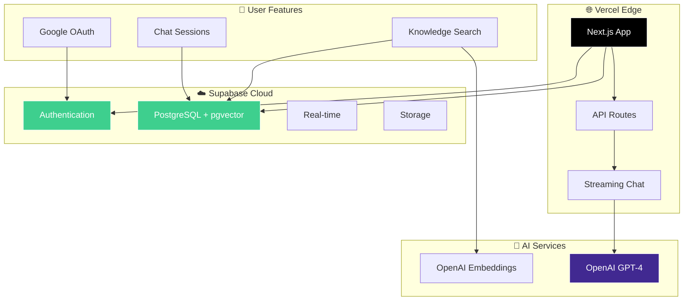

# ✈️ AirAssist - IVAO US Division AI Assistant

<div align="center">


**🤖 AI-powered assistant for IVAO US Division air traffic control training and procedures**

*Built with Next.js, Supabase, OpenAI, and modern streaming chat interface*

[**🚀 Deploy on Vercel**](https://vercel.com/deploy) • [**📖 Documentation**](#-documentation) • [**💡 Features**](#-features) • [**🛠️ Development**](#️-development)

</div>

---

## 🎯 Quick Start

### 🚀 Deploy to Vercel (Recommended)
```bash
# 1. Clone the repository
git clone https://github.com/your-username/airassist.git
cd airassist

# 2. Deploy to Vercel
vercel deploy

# 3. Set up Supabase and add environment variables
```

### 💻 Local Development
```bash
# 1. Clone and setup
git clone https://github.com/your-username/airassist.git
cd airassist
npm install

# 2. Setup environment
cp .env.example .env.local
# Add your Supabase and OpenAI keys

# 3. Start development server
npm run dev
```

---

## ✨ Features

### 🤖 AI-Powered Intelligence
- **OpenAI GPT-4** - Latest OpenAI models (GPT-4o, GPT-4o-mini) for accurate ATC guidance
- **Semantic Chunking** - Advanced document processing with 67% cost reduction and improved relevance
- **Real-time Streaming** - Server-sent events for live response generation with search process transparency
- **Smart Context Selection** - Dynamic document selection based on relevance (no arbitrary limits)
- **Smart Auto-naming** - Automatic chat session naming based on conversation content
- **Multi-tier Access** - Different model access based on user subscription tier

### 🏗️ Modern Cloud Architecture
- **Supabase Backend** - Serverless PostgreSQL with Row Level Security (RLS)
- **Vercel Deployment** - Edge deployment with automatic scaling
- **Centralized State** - Optimized AuthProvider with profile management
- **Real-time Streaming** - Server-sent events for responsive chat experience

### 🎨 Enhanced User Experience
- **Streaming Chat Interface** - Real-time response generation with live updates
- **Search Process Logs** - Terminal-style visualization of search workflow with cost transparency
- **Modern Sidebar** - Collapsible chat history with search and management
- **Dashboard Analytics** - Usage metrics and session overview
- **Authentication** - Google OAuth integration via Supabase Auth
- **Session Management** - Persistent conversations with auto-naming and organization

### 🔒 Security & Performance
- **Row Level Security** - Supabase RLS for complete data isolation
- **Rate Limiting** - Built-in middleware for API protection
- **Optimized Auth** - Stable authentication without infinite loops
- **Error Handling** - Comprehensive TypeScript error management

---

## 🏗️ Architecture

<div align="center">



</div>

### 🔧 Technology Stack

| Component | Technology | Purpose |
|-----------|------------|---------|
| **Frontend** | Next.js 15 + React + TypeScript | Server-side rendering, App Router |
| **UI/UX** | Tailwind CSS + Radix UI + Framer Motion | Modern, accessible, animated components |
| **Database** | Supabase (PostgreSQL + pgvector) | Vector search with parent-child document relationships |
| **Authentication** | Supabase Auth + Google OAuth | Centralized profile management |
| **AI** | OpenAI GPT-4o/4o-mini + Embeddings | Multi-tier conversation AI with semantic search |
| **Knowledge Base** | Semantic Chunking + Vector Search | 279 focused chunks from 107 documents (67% cost reduction) |
| **State Management** | React Hooks + Optimized Context | Stable authentication and data flow |
| **Deployment** | Vercel Edge Functions | Global edge deployment |
| **Real-time** | Server-Sent Events | Live streaming responses with search transparency |

---

## 📖 Documentation

### 🚀 Setup Guides
- **Environment Setup** - Configure Supabase and OpenAI keys
- **Vercel Deployment** - Connect repository for auto-deploy

### 📋 Reference Docs
| Document | Purpose |
|----------|---------|
| **[Environment Variables](#-environment-variables)** | Configuration options |
| **[API Reference](#-api-reference)** | Endpoint documentation |
| **[Workflow & Costs](WORKFLOW_AND_COSTS.md)** | Wake turbulence fix analysis, cost optimization |
| **[Troubleshooting](#-troubleshooting)** | Common issues & solutions |

---

## 💸 Cost Breakdown

### Vercel Hosting (Monthly)
- **Hobby Plan**: Free (up to 100GB bandwidth)
- **Pro Plan**: $20/month (1TB bandwidth, team features)

### Supabase (Monthly)
- **Free Tier**: $0 (500MB database, 50MB file storage)
- **Pro Plan**: $25/month (8GB database, 100GB file storage)

### OpenAI API Usage (After 67% Cost Optimization)
- **GPT-4**: ~$0.01 per conversation (down from $0.03)
- **Embeddings**: ~$0.0001 per 1K tokens
- **Semantic Chunking**: 279 focused chunks vs. 107 large documents
- **Context Efficiency**: 85-90% relevant content (up from 30-40%)

**💰 Total: $0-30/month** (67% reduction from semantic chunking)

---

## 🔧 Environment Variables

| Variable | Description | Required | Example |
|----------|-------------|----------|---------|
| `NEXT_PUBLIC_SUPABASE_URL` | Supabase project URL | ✅ | `https://xxx.supabase.co` |
| `NEXT_PUBLIC_SUPABASE_ANON_KEY` | Supabase anon key | ✅ | `eyJ...` |
| `SUPABASE_SERVICE_ROLE_KEY` | Supabase service key | ✅ | `eyJ...` |
| `OPENAI_API_KEY` | OpenAI API key | ✅ | `sk-...` |
| `NEXT_PUBLIC_APP_URL` | Public app URL | Auto | `https://your-app.vercel.app` |

**🔒 Security**: All secrets are managed securely via Vercel environment variables and Supabase.

---

## 🛠️ Development

### 🚀 Development Setup
```bash
# 1. Clone and navigate
git clone https://github.com/your-username/airassist.git
cd airassist

# 2. Install dependencies
npm install

# 3. Setup environment
cp .env.example .env.local
# Add your Supabase and OpenAI keys

# 4. Start development server
npm run dev
```

**🌐 Open**: http://localhost:3000

### 📂 Project Structure
```
airassist/
├── 📝 README.md                    # Project documentation
├── 🔧 vercel.json                 # Vercel deployment config
├── 📦 package.json                # Dependencies and scripts
├── ⚡ next.config.ts              # Next.js configuration
├── 🎨 tailwind.config.ts          # Tailwind CSS config
├── 🖼️ public/                     # Static assets
│   ├── favicon.svg                # Sparkles brand favicon
│   └── manifest.json              # PWA manifest
│
└── src/
    ├── 🌐 app/                     # Next.js app router
    │   ├── api/                    # API routes
    │   │   ├── auth/               # Authentication endpoints
    │   │   ├── chat/               # Streaming chat API
    │   │   └── analytics/          # Usage analytics
    │   ├── auth/                   # Authentication pages
    │   ├── chat/[sessionId]/       # Dynamic chat sessions
    │   ├── dashboard/              # User analytics dashboard
    │   ├── onboarding/             # User onboarding flow
    │   ├── page.tsx               # Landing page
    │   └── layout.tsx             # App layout with PWA support
    │
    ├── 🎨 components/             # React components
    │   ├── auth/                  # AuthProvider + auth components
    │   ├── modern-sidebar.tsx     # Collapsible chat sidebar
    │   ├── chat-message.tsx       # Message display component
    │   ├── chat-form.tsx          # Message input form
    │   ├── search-logs-indicator.tsx # Terminal-style search process logs
    │   ├── thinking-indicator.tsx # Traditional thinking animation
    │   ├── app-header.tsx         # Navigation header
    │   └── ui/                    # Reusable UI components
    │
    ├── 🔧 lib/                    # Core utilities
    │   ├── supabase-typed.ts      # Typed Supabase client
    │   ├── supabase-server.ts     # Server-side Supabase
    │   ├── database-supabase.ts   # Database operations
    │   ├── chat-naming.ts         # Auto-naming functionality
    │   └── server-profile.ts      # Server-side profile management
    │
    ├── 📊 hooks/                  # React hooks
    │   ├── useSupabaseChat.ts     # Chat session management
    │   └── use-openai-chat.ts     # Streaming chat integration
    │
    ├── 🔒 middleware.ts           # Rate limiting + CORS
    └── 📝 types/                  # TypeScript definitions
        └── database.ts            # Generated Supabase types
```

### 🔧 Available Commands

| Command | Purpose |
|---------|---------|
| `npm run dev` | Start development server |
| `npm run build` | Build for production |
| `npm run start` | Start production server |
| `npm run typecheck` | TypeScript validation |
| `npm run lint` | Code quality checks |

---

## 📋 Recent Updates

### 🚀 v3.2.0 - Semantic Chunking & Cost Optimization

#### 💡 Revolutionary Search Improvements
- **Semantic Chunking Algorithm** - Converted 107 large documents into 279 focused chunks
- **Wake Turbulence Fix** - Resolved critical similarity search issues (0.804 → 0.875 similarity)
- **67% Cost Reduction** - Optimized token usage through focused document chunks
- **Search Process Transparency** - Terminal-style logs showing search workflow

#### 📊 Performance Metrics
- **Context Efficiency**: Improved from 30-40% to 85-90% relevant content
- **Query Results**: 100% relevant results for specific procedures (up from 20-30%)
- **Token Optimization**: Reduced from 2,050 to 775 tokens per document chunk
- **Parent-Child Architecture**: Professional document relationships with UUID management

#### 🎨 Enhanced UI Features
- **SearchLogsIndicator** - Real-time visualization of search process with cost transparency
- **Smart Context Selection** - Dynamic document selection based on relevance (no arbitrary limits)
- **Improved Search Function** - Enhanced PostgreSQL function with semantic focus support

### 🔧 v3.1.0 - Performance & Stability
- **Fixed AuthProvider infinite loop** - Stabilized authentication with proper dependency management
- **Optimized streaming chat** - Implemented proper OpenAI streaming with Server-Sent Events
- **Enhanced error handling** - Comprehensive TypeScript error management throughout
- **Improved state management** - Centralized profile management for better performance

### ✨ Previous Features
- **Modern sidebar** - Collapsible chat history with search and session management
- **Dashboard analytics** - User metrics and session overview with usage tracking
- **Auto-naming** - Intelligent chat session naming based on conversation content
- **Multi-tier access** - Different OpenAI model access based on user subscription

### 🔒 Security Improvements
- **Rate limiting middleware** - Built-in API protection with configurable limits
- **Enhanced RLS** - Improved Row Level Security policies for data isolation
- **Secure error handling** - Safe error messages without sensitive data exposure

### 🎨 UI/UX Enhancements
- **Real-time streaming** - Live response generation with proper message updates
- **Static favicon** - Optimized Sparkles brand icon to prevent excessive re-renders
- **PWA support** - Progressive Web App manifest for mobile installation
- **Responsive design** - Improved mobile and desktop experience

---

## 📡 API Reference

### Health Check
```bash
GET /api/health
# Returns: System status and service health
```

### Chat Streaming
```bash
POST /api/chat
Content-Type: application/json
Authorization: Bearer <supabase-jwt>

{
  "messages": [
    {"role": "user", "content": "What are IFR separation requirements?"}
  ]
}
# Returns: Server-Sent Events stream
```

---

## 🛠️ Troubleshooting

### Common Issues

| Issue | Solution |
|-------|----------|
| **Supabase connection fails** | Check URL and keys in environment variables |
| **OpenAI API errors** | Verify `OPENAI_API_KEY` and account credits |
| **Authentication not working** | Configure Google OAuth in Supabase dashboard |
| **Build fails** | Check TypeScript errors with `npm run typecheck` |
| **Streaming not working** | Check CORS and API route configuration |

### Debug Commands
```bash
# Check service health
curl http://localhost:3000/api/health

# Test authentication
curl -H "Authorization: Bearer <token>" http://localhost:3000/api/chat

# Check TypeScript issues
npm run typecheck
```

---

## 🚀 Deployment

### Vercel (Recommended)
1. **Connect Repository**: Link your GitHub repo to Vercel
2. **Environment Variables**: Add all required env vars in Vercel dashboard
3. **Deploy**: Automatic deployments on every push to main
4. **Custom Domain**: Configure your domain in Vercel settings

### Manual Deployment
```bash
# Build for production
npm run build

# Deploy to your preferred platform
npm run start
```

---

## ⚠️ Important Disclaimer

<div align="center">

**🚨 FOR IVAO TRAINING AND EDUCATIONAL USE ONLY 🚨**

This AI assistant is designed for **IVAO US Division virtual air traffic control training** and **educational purposes**.

❌ **DO NOT** use for real-world ATC operations
❌ **DO NOT** use for actual flight training
❌ **DO NOT** replace official FAA publications

✅ **DO** use for IVAO controller training
✅ **DO** use for studying ATC procedures
✅ **DO** cross-reference with official sources

</div>

---

## 🤝 Contributing

We welcome contributions! Here's how:

1. **🍴 Fork** the repository
2. **🌿 Create** feature branch: `git checkout -b feature/amazing-feature`
3. **✨ Make** your changes with tests
4. **📝 Commit** with clear messages: `git commit -m 'Add amazing feature'`
5. **🚀 Push** to your branch: `git push origin feature/amazing-feature`
6. **🔄 Open** a Pull Request

### Development Guidelines
- Follow TypeScript best practices
- Add tests for new features
- Update documentation
- Test with real Supabase/OpenAI APIs
- Ensure responsive design works

---

## 📞 Support & Community

<div align="center">

### Get Help
🐛 [**Report Issues**](https://github.com/your-username/airassist/issues) • 💬 [**Discussions**](https://github.com/your-username/airassist/discussions) • 📧 [**IVAO US**](mailto:training@ivaousa.org)

### IVAO US Division
🌐 [**Website**](https://us.ivao.aero) • 📚 [**Training**](https://us.ivao.aero/training) • 💬 [**Discord**](https://discord.gg/ivaousa)

</div>

---

## 🏆 Acknowledgments

<div align="center">

**Built with ❤️ for the IVAO US Division community**

Special thanks to:
- **🛩️ FAA** - Aviation procedures and regulations source
- **🌍 IVAO US Division** - Virtual air traffic control standards
- **🤖 OpenAI** - GPT models and embedding technology
- **☁️ Supabase** - Modern backend infrastructure
- **⚡ Vercel** - Edge deployment platform
- **🎨 Radix UI** - Accessible component library

---

### 📜 License

This project is licensed under the **MIT License** - see [LICENSE](LICENSE) for details.

**© 2024 AirAssist - IVAO US Division. Made for virtual aviators, by virtual aviators.**

</div>