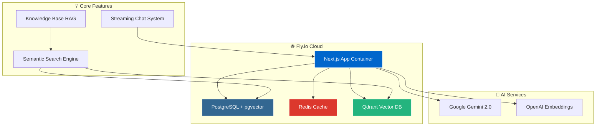

# ✈️ ATC Assistant - AI-Powered Aviation Guidance System

<div align="center">


**🤖 AI-powered assistant for Air Traffic Control procedures, regulations, and flight operations**

*Built with Next.js, PostgreSQL, pgvector, and advanced semantic search capabilities*

[**🚀 Deploy Now**](DEPLOY-GUIDE.md) • [**📖 Documentation**](#-documentation) • [**💡 Features**](#-features) • [**🛠️ Development**](#️-development)

</div>

---

## 🎯 Quick Start

### 🚀 Deploy to Fly.io (Easiest)
```bash
# 1. Run the magic deployment script
./deploy-fly.sh

# 2. Enter your API keys when prompted
# 3. That's it! Your app will be live in minutes
```

**👉 [Complete Deployment Guide](DEPLOY-GUIDE.md)** - Step-by-step for non-technical users

### 💻 Local Development  
```bash
# Quick setup
docker-compose -f docker-compose.dev.yml up -d
npm install && npm run dev
```

**👉 [Development Guide](#️-development)** - Full development setup

---

## ✨ Features

### 🤖 AI-Powered Intelligence
- **Gemini 2.0 Flash Integration** - Latest Google AI for accurate ATC guidance
- **Real-time Streaming** - Watch AI responses generate live with thinking process
- **Semantic Search** - Vector-based search using pgvector for precise answers
- **Smart Token Management** - No more quota issues! Only relevant chunks sent to AI

### 🏗️ Production-Ready Architecture
- **Fly.io Deployment** - One-click deployment with automatic scaling
- **PostgreSQL + pgvector** - Enterprise-grade database with vector search
- **Redis Caching** - Smart embedding cache with 7-day expiry
- **Docker Compose** - Full containerization for any platform

### 🎨 Modern User Experience
- **Streaming Chat Interface** - See responses as they're generated
- **Thinking Display** - Shows AI reasoning process while working
- **Enhanced UI/UX** - Beautiful gradients, animations, and modern design
- **Chat History** - Persistent conversations with smart session management

### 🔒 Security & Performance
- **Secure Environment Management** - Proper secret handling via Fly.io
- **Rate Limiting** - Built-in protection against abuse
- **Health Monitoring** - Comprehensive health checks and logging
- **Auto-scaling** - Handles traffic spikes automatically

---

## 🏗️ Architecture

<div align="center">



</div>

### 🔧 Technology Stack

| Component | Technology | Purpose |
|-----------|------------|---------|
| **Frontend** | Next.js 15 + React | Server-side rendering, routing |
| **UI/UX** | Tailwind CSS + Radix UI | Modern, accessible components |
| **Database** | PostgreSQL 16 + pgvector | Vector storage, full-text search |
| **Caching** | Redis | Embedding cache, sessions |
| **Vector DB** | Qdrant | Dedicated vector similarity search |
| **AI** | Google Gemini 2.0 Flash | Main conversation AI |
| **Embeddings** | OpenAI ada-002 | Text vectorization |
| **Deployment** | Fly.io | Auto-scaling cloud platform |
| **Containers** | Docker + Docker Compose | Consistent deployments |

---

## 📖 Documentation

### 🚀 Deployment Guides
- **[Complete Deployment Guide](DEPLOY-GUIDE.md)** - Everything you need to deploy
- **[Testing Guide](TESTING.md)** - Quality assurance and validation

### 📋 Reference Docs
| Document | Purpose |
|----------|---------|
| **[API Reference](#-api-reference)** | Endpoint documentation |
| **[Environment Variables](#-environment-variables)** | Configuration options |
| **[Docker Setup](#-docker-deployment)** | Container deployment |
| **[Troubleshooting](#-troubleshooting)** | Common issues & solutions |

---

## 💸 Cost Breakdown

### Fly.io Hosting (Monthly)
- **App Container**: ~$5-10 (shared CPU, 1GB RAM)
- **PostgreSQL**: ~$0-15 (3GB storage, backup included)  
- **Redis**: ~$0 (free tier sufficient)

### AI API Usage
- **Google Gemini**: ~$0.01 per conversation
- **OpenAI Embeddings**: ~$0.10 per 1000 searches

**💰 Total: ~$10-25/month** (scales with usage)

---

## 🔧 Environment Variables

| Variable | Description | Required | Default |
|----------|-------------|----------|---------|
| `GOOGLE_API_KEY` | Google Gemini API key | ✅ | - |
| `OPENAI_API_KEY` | OpenAI embeddings key | ✅ | - |
| `DATABASE_URL` | PostgreSQL connection | Auto | Fly.io managed |
| `REDIS_URL` | Redis connection | Auto | Fly.io managed |
| `NEXTAUTH_SECRET` | Auth encryption key | Auto | Generated |
| `NEXT_PUBLIC_APP_URL` | Public app URL | Auto | Fly.io domain |

**🔒 Security**: All secrets are managed securely via Fly.io's encrypted secrets system.

---

## 🛠️ Development

### 🚀 Quick Development Setup
```bash
# 1. Clone and navigate
git clone https://github.com/your-username/airassist.git
cd airassist

# 2. Start databases (Docker required)
docker-compose -f docker-compose.dev.yml up -d

# 3. Install dependencies and start
npm install
cp .env.example .env  # Add your API keys
npm run db:migrate
npm run dev
```

**🌐 Open**: http://localhost:3000

### 📂 Project Structure
```
airassist/
├── 🎯 DEPLOY-GUIDE.md          # Complete deployment guide
├── 🧪 TESTING.md               # Testing procedures
├── 🐳 Dockerfile.fly           # Fly.io optimized container
├── ⚡ fly.toml                  # Fly.io configuration
├── 🚀 deploy-fly.sh            # One-click deployment script
│
├── src/
│   ├── 🤖 ai/                  # AI logic and flows
│   │   ├── assistant.ts        # Main AI assistant with streaming
│   │   └── genkit.ts          # Genkit AI configuration
│   │
│   ├── 🌐 app/                 # Next.js app router
│   │   ├── api/               # API routes
│   │   │   ├── health/        # Health check endpoint
│   │   │   └── chat/stream/   # Streaming chat API
│   │   ├── page.tsx           # Main application page
│   │   └── enhanced-page.tsx  # Enhanced streaming UI
│   │
│   ├── 🎨 components/         # React components
│   │   ├── enhanced-chat-*    # Modern streaming chat UI
│   │   ├── thinking-display   # AI reasoning display
│   │   └── ui/               # Reusable UI components
│   │
│   ├── 🔧 lib/                # Core utilities
│   │   ├── database-pg.ts     # PostgreSQL + pgvector
│   │   ├── embeddings.ts      # OpenAI embedding service
│   │   └── semantic-search.ts # Vector similarity search
│   │
│   └── 📊 hooks/              # React hooks
│       └── use-streaming-chat # Real-time chat streaming
│
├── 🗄️ db/init/                # Database initialization
└── 🐳 docker-compose*.yml     # Container orchestration
```

### 🔧 Available Commands

| Command | Purpose |
|---------|---------|
| `npm run dev` | Start development server |
| `npm run build` | Build for production |
| `npm run db:migrate` | Initialize database schema |
| `npm run seed` | Import knowledge base |
| `npm run docker:dev` | Start development databases |
| `npm run typecheck` | TypeScript validation |
| `npm run lint` | Code quality checks |

---

## 📡 API Reference

### Health Check
```bash
GET /api/health
# Returns system status and service health
```

### Chat Streaming
```bash
POST /api/chat/stream
Content-Type: application/json

{
  "messages": [
    {"role": "user", "content": "What are IFR separation requirements?"}
  ]
}
# Returns: Server-Sent Events stream
```

### Knowledge Search  
```bash
POST /api/search
Content-Type: application/json

{
  "query": "runway incursion procedures",
  "limit": 10
}
# Returns: Relevant knowledge base entries
```

---

## 🐳 Docker Deployment

### Development
```bash
# Start only databases for local development
docker-compose -f docker-compose.dev.yml up -d

# Check services
docker-compose -f docker-compose.dev.yml ps
```

### Self-Hosted Production
```bash
# Full stack deployment
docker-compose up --build -d

# With nginx reverse proxy
docker-compose --profile production up -d
```

### Fly.io (Recommended)
```bash
# One-click deployment
./deploy-fly.sh

# Manual deployment
flyctl deploy --dockerfile Dockerfile.fly
```

---

## 🛠️ Troubleshooting

### Common Issues

| Issue | Solution |
|-------|----------|
| **Port conflicts** | `docker-compose down && docker system prune` |
| **Database won't connect** | Check `DATABASE_URL` and restart containers |
| **API quota exceeded** | Verify API keys and usage limits |
| **Embeddings not working** | Check `OPENAI_API_KEY` and Redis connection |
| **Streaming not working** | Verify WebSocket connections and CORS |

### Debug Commands
```bash
# Check service health
curl http://localhost:3000/api/health

# View application logs
docker-compose logs -f app

# Test database connection  
docker-compose exec postgres psql -U airassist_user -d airassist

# Clear caches
docker-compose exec redis redis-cli flushall
```

---

## ⚠️ Important Disclaimer

<div align="center">

**🚨 FOR EDUCATIONAL AND SIMULATION USE ONLY 🚨**

This AI assistant is designed for **IVAO virtual air traffic control training** and **educational purposes**.

❌ **DO NOT** use for real-world ATC operations  
❌ **DO NOT** use for actual flight training  
❌ **DO NOT** replace official FAA publications  

✅ **DO** use for IVAO controller training  
✅ **DO** use for studying ATC procedures  
✅ **DO** cross-reference with official sources  

</div>

---

## 🤝 Contributing

We welcome contributions! Here's how:

1. **🍴 Fork** the repository
2. **🌿 Create** feature branch: `git checkout -b feature/amazing-feature`  
3. **✨ Make** your changes with tests
4. **📝 Commit** with clear messages: `git commit -m 'Add amazing feature'`
5. **🚀 Push** to your branch: `git push origin feature/amazing-feature`
6. **🔄 Open** a Pull Request

### Development Guidelines
- Follow TypeScript best practices
- Add tests for new features  
- Update documentation
- Ensure Docker builds work
- Test deployment scripts

---

## 📞 Support & Community

<div align="center">

### Get Help
🐛 [**Report Issues**](https://github.com/your-username/airassist/issues) • 💬 [**Discussions**](https://github.com/your-username/airassist/discussions) • 📧 [**Email**](mailto:support@example.com)

### Stats & Info


</div>

---

## 🏆 Acknowledgments

<div align="center">

**Built with ❤️ for the aviation community**

Special thanks to:
- **🛩️ FAA** - Aviation procedures and regulations
- **🌍 IVAO** - Virtual air traffic control standards  
- **🤖 OpenAI** - Embedding models and AI research
- **🧠 Google** - Gemini AI models
- **🚀 Fly.io** - Cloud deployment platform
- **🐳 Docker** - Containerization technology

---

### 📜 License

This project is licensed under the **MIT License** - see [LICENSE](LICENSE) for details.

**© 2024 ATC Assistant. Made for aviators, by aviators.**

</div>  
